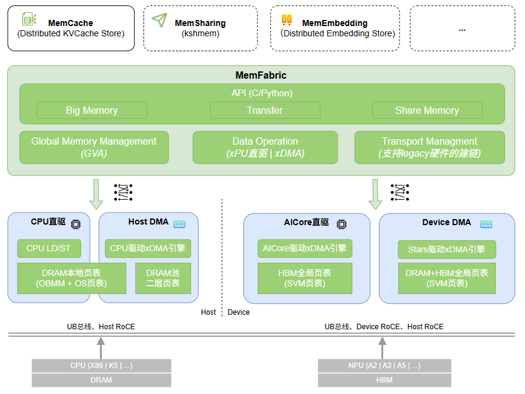
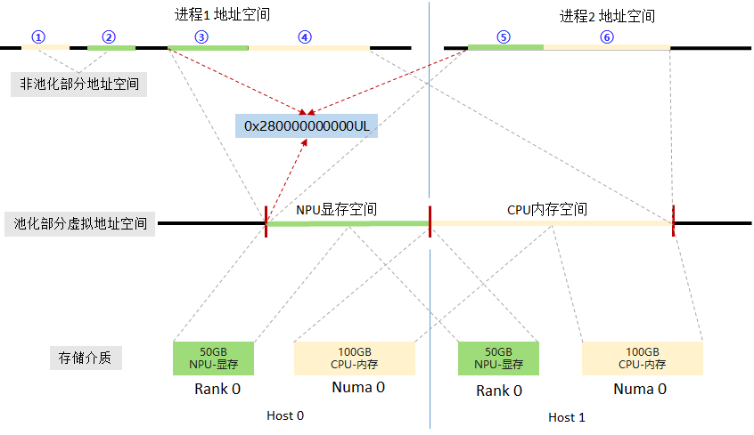
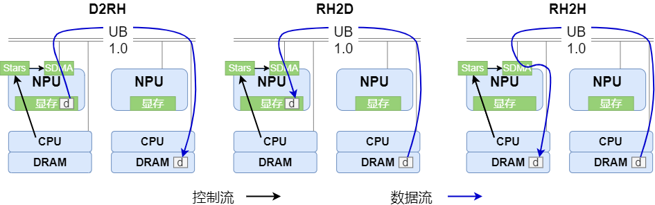
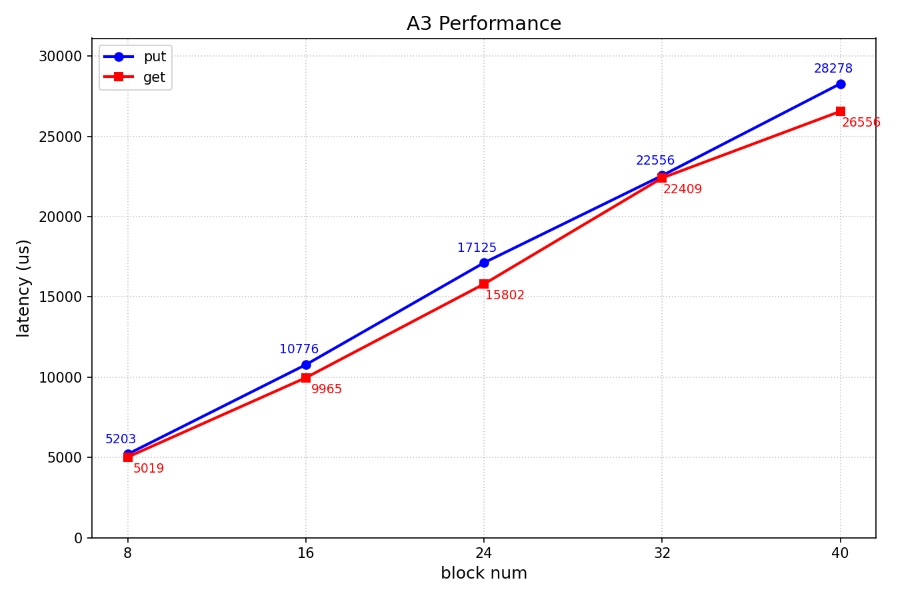
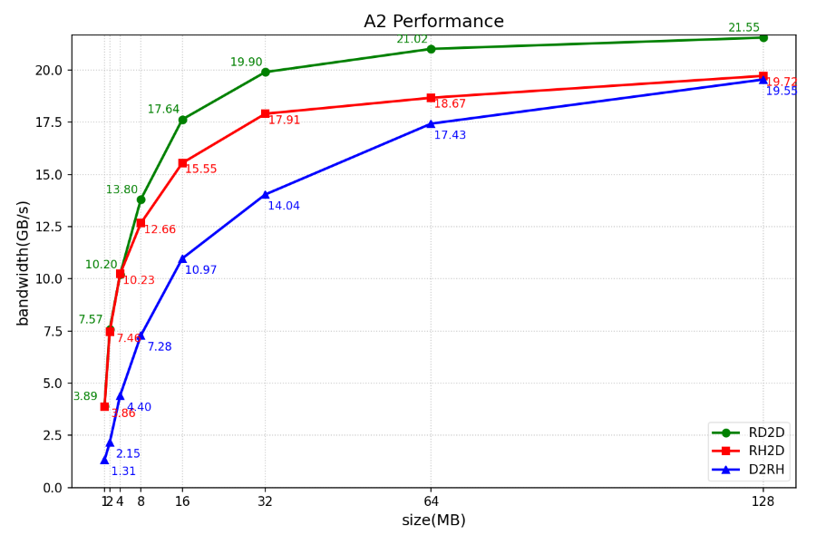

<div align="center">
  
  <hr style="display:block; border:none; height:0; border-top:2px solid #008000; width:100%; max-width:1250px; margin:20px auto;">
  <h2 align="center">
DRAM&HBM hybrid pooling, memory semantic interface, high-performance cross-machine memory direct access
  </h2>

[](https://gitcode.com/Ascend/memfabric_hybrid)
[](https://pypi.org/project/memfabric-hybrid/#history)
[](https://pypi.org/project/memfabric-hybrid/)
[](https://pypi.org/project/memfabric-hybrid/)
[](https://gitcode.com/Ascend/memfabric_hybrid/analysis)
[](https://gitcode.com/Ascend/memcache/blob/master/LICENSE)

</div>
<br/>

> **仓库说明：** 此目录是基于 MemFabric Hybrid 整理的 A5 Sparse KV
> Offload 生产算子精简版，重点保留 Compact V3、ResidentAddrs Parallel
> 和 AIV SparseCopy。它不是上游项目的完整历史版本集合；上游项目、文档和
> 发布信息请以原社区仓库为准。

## 🔄Latest News

- [2026/01] DRAM池化相关配套已发布支持，详见[软件硬件配套](#软件硬件配套说明)

- [2025/12] MemFabric + MemCache已作为vllm-ascend backend使能大模型推理加速，详情查看vllm-ascend开源社区，[使用示例](https://github.com/vllm-project/vllm-ascend/blob/main/docs/source/user_guide/feature_guide/kv_pool.md#example-of-using-memcache-as-a-kv-pool-backend)

- [2025/11] MemFabric项目于2025年11月开源，在昇腾上提供高效的多链路的D2RH,RH2D,RH2H,D2D,D2H,H2D等内存直接访问能力。


## 🔜 Roadmap

MemFabric roadmap和版本分支策略详见： [**Roadmap**](https://gitcode.com/Ascend/memfabric_hybrid/wiki/Roadmap.md)


## 🎉概述

  MemFabric是一款开源内存池化软件，面向昇腾超节点和服务器等，其设计目的与核心思想是:
  - 异构设备的统一池化: 将多节点的异构设备内存(DRAM|HBM等)池化, 提供高性能的全局内存"直接访问"的能力
  - 简单的北向接口: 提供内存语义访问接口, 即xcopy with global virtual address, 向传统的memcpy概念靠近, 支持D2RH\RH2D\RH2H\D2D等
  - 南向高可扩展: 通过插件的方式支持多种DMA引擎和LD/ST及多种网络/灵衢互联(Device UB、Device RoCE、Host UB、Host RoCE等)



如上图所示, MemFabric主要分为四大模块: Global Memory Management、Data Operation、Transport Management、API
  * **Global Memory Management**: 实现全局统一内存地址(Global Virtual Address, GVA)的统一编排、页表映射策略制定及通过驱动将映射策略注入页表
  * **Data Operation**: xcopy的实现，驱动xDMA、LD/ST实现全局内存直接读写
  * **Transport Management**: 链接管理; xcopy驱动Host RDMA、Device RDMA、UDMA时，需要建立QP、Jetty链接，xcopy使用SDMA、MTE、LD/ST时不需要Transport Management
  * **API**: 统一且简单的API及其实现, 包括BM API、SHM API、Trans API，三种API适用于不同的场景

其中, Global Memory Management、Data Operation、Transport Management都实现了逻辑的抽象, 可以轻松扩展实现不同硬件的对接。当前已支持的南向包括:
  * 昇腾A3超节点: DRAM+HBM pooling over Device UB 1.0, DRAM pooling over Host RoCE
  * 昇腾A2服务器: DRAM+HBM pooling over Device RoCE, DRAM pooling over Host RoCE
  * 鲲鹏服务器: DRAM pooling over Host RoCE
  * 鲲鹏超节点: DRAM pooling over Host UB

MemFabric以动态库的形式支持应用快速，简便的集成，支撑大模型KV缓存、生成式推荐缓存、强化训练参数Reshard、模型参数缓存、PD传输等多种业务场景。

### 本分支的 A5 Sparse KV Offload 生产算子

本公开整理版聚焦 Ascend 950PR/A5 Sparse KV Offload，仅保留当前生产实现：

```text
LRU Compact V3
    -> ResidentAddrs Parallel V1
    -> AIV/DataCopyPad SparseCopy
```

- Compact V3 对 `topk/capacity/max_token=2048/4096/4096` 自动启用；
- ResidentAddrs Parallel 对 `num_reqs=1, topk<=2048` 自动启用；
- 其他 shape 由内部 SIMT fallback 安全处理；
- SparseCopy 固定使用已验证的 AIV/DataCopyPad registered-Host 路径。

用户不再需要选择 V1/V2/V3 实验 backend。详细文件与 shape 契约见
[A5 production kernel guide](src/acc_offload/csrc/operators/README_SIMT.md)。


## 🧩核心特性

- **池化与全局统一编址**

MemFabric通过构建逻辑上的全局内存语义统一编址，对分布在不同层级、不同节点的内存单元进行统一管理与使用，使系统能够像管理单一物理资源一样，对跨CPU、NPU的内存资源进行统一寻址和透明访问，核心目的是实现内存资源的整合与统一调度，最大程度的释放硬件性能。
GVA的特点:
  - 它是一个简单的uint64
  - 所有进程的GVA的起始地址一致
  - 所有进程的GVA按线性排布且一致



- **跨机跨介质直接访问**

  基于MemFabric内存语义统一编址，数据可以在跨节点的多级存储间实现透明、直接访问。

  典型跨节点跨介质的访问路径有：
    - D2RH：本机HBM到跨机DRAM
    - RH2D：跨机DRAM到本机HBM
    - RH2H：跨机DRAM到本机DRAM

  Note: D为Device, RH为Remote Host

MemFabric跨机访问数据流和控制流如下图所示(昇腾A3超节点):



当前MemFabric池化的硬件支持情况如下：
* 昇腾A3超节点：Device UB 1.0，Host rdma
* 昇腾A2服务器：Device rdma，Host rdma
* 鲲鹏服务器: Host rdma

| 池化类型         | 访问方向  | host rdma | device rdma | Device UB 1.0   |
|-----------------|----------|-----------|-------------|----------------|
| DRAM POOL       |   LD2GH  | ✅        | ✅         | ✅           |
| DRAM POOL       |   GH2LD  | ✅        | ✅         | ✅           |
| DRAM POOL       |   LH2GH  | ✅        | ✅         | ✅           |
| DRAM POOL       |   GH2LH  | ✅        | ✅         | ✅           |
| HBM POOL        |   GD2LH  | ❌         | ✅         | ✅           |
| HBM POOL        |   LH2GD  | ❌         | ✅         | ✅           |
| HBM POOL        |   GD2LD  | ❌         | ✅         | ✅           |
| HBM POOL        |   LD2GD  | ❌         | ✅         | ✅           |
| HBM + DRAM POOL |   GH2GD  | ❌         | ✅         | ✅           |
| HBM + DRAM POOL |   GD2GH  | ❌         | ✅         | ✅           |
| HBM + DRAM POOL |   GH2GH  | ❌         | ✅         | ✅           |
| HBM + DRAM POOL |   GD2GD  | ❌         | ✅         | ✅           |

**Note：**
> L为Local，D为Device，G为Global，H为Host
- GH ：代表一块DRAM内存，其属于DRAM内存池空间，可能在本地，也可能在远端其他节点
- GD ：代表一块HBM显存，其属于HBM内存池空间，可能在本地，可能在远端其他节点
- LH ：代表一块DRAM内存，其不属于任何内存池空间，其位置在当前进程
- LD ：代表一块HBM显存，其不属于任何内存池空间，其位置在当前进程

## 🔥性能表现

### 时延测试
- 使用2个昇腾A3节点组成双机内存池，将MemFabric对接到MoonCake TE（MoonCake是业界开源的一款的分布式缓存软件, [memfabric对接mooncake代码](https://gitcode.com/openFuyao/mooncake/blob/v0.3.7-dev/doc/zh/ub_transport.md)）进行读写时延测试，模拟构造DeepSeek-R1模型KV大小的block size，即：61x128K + 61x16K = 8784KB ≈ 8.57MB，共122个离散地址，性能表现如下:



### 带宽测试(单DIE+单CPU)
- 在昇腾A3超节点跨机数据访问性能(DRAM and HBM pooling over UB 1.0)如下：

| 数据传输方向 | 单次数据大小（GB） | 带宽（GB/s）|
|--------| -----------------| --------- |
| RH2D   | 1 | 110.23 |
| RH2D   | 2 | 110.19 |
| D2RH   | 1 | 74.54 |
| D2RH   | 2 | 74.54 |
| RD2D   | 1 | 166.47 |
| RD2D   | 2 | 166.47 |
| D2RD   | 1 | 138.01 |
| D2RD   | 2 | 138.01 |
**注**：和昇腾官方带宽测试工具[ascend-dmi](https://www.hiascend.com/document/detail/zh/mindx-dl/600/toolbox/ascenddmi/toolboxug_0015.html)一样，A3超节点测试采用的通信带宽的统计方式，
1 GB/s = 1000 * 1000 * 1000 B/s


- 在昇腾A2服务器跨机数据访问性能(DRAM and HBM pooling over Device RoCE)如下:



 👆 性能测试参考 [benchmark](./example/bm/BmBenchmark/README.md)

## 🔍目录结构

```
├── LICENSE                    # LICENSE
├── .clang-format              # 格式化配置
├── .gitmodules                # 三方库git配置
├── .gitignore                 # git忽视文件
├── CMakeLists.txt             # 项目的CMakeList
├── doc                        # 文档目录
├── example                    # 样例
│  ├── bm                      # big memory样例
│  └── shm                     # share memory样例
│  └── trans                   # batch data write/read样例
│  └── decrypt                 # 自定义解密库示例(控制路径)
├── script                     # 构建脚本
│  ├── build_and_pack_run.sh   # 编译+打包脚本
│  ├── build.sh                # 编译脚本
│  ├── run_ut.sh               # 编译+运行ut脚本
├── test                       # test目录
│  ├── 3rdparty                # 三方库
│  ├── certs                   # 证书生成脚本
│  ├── python                  # python测试用例
│  └── ut                      # 单元测试用例
├── src                        # 源码
│  ├── acc_links               # 内部通信层 (用于进程间控制命令的通信, 基于Host TCP实现)
│  └── hybm                    # 内存管理与内存访问层 (Global Memory Management、Data Operation、Transport Management)
│  └── smem                    # 语义与接口层 (big memory + transfer + share memory等语义与接口实现)
│  └── util                    # 公共函数
├── README.md
```

## 🚀快速入门

请访问以下文档获取简易教程。

- [编译安装](./doc/installation.md)：介绍组件编译和安装教程。

- [样例执行](./example/examples.md)：介绍如何端到端执行样例代码，包括C++和Python样例。

## 📑学习教程

- [API介绍](./doc/feature.md)：MemFabric提供的多种API的简介

- [C接口](./doc/API.md)：C接口介绍以及C接口对应的API列表

- [python接口](./doc/pythonAPI.md)：python接口介绍以及python接口对应的API列表

- [ptracer](./doc/ptracer.md)：MemFabric内置性能打点工具简介

## 📦软件硬件配套说明
- 硬件型号支持
  - Atlas 200T A2 Box16
  - Atlas 800I A2/A3 系列产品
  - Atlas 800T A2/A3 系列产品
  - Atlas 900 A3 SuperPoD
- 平台：aarch64/x86
- 配套软件：CANN 8.1.RC1及之后版本
- cmake >= 3.19
- GLIBC >= 2.28
- Ascend HDK配套驱动（npu-driver）、固件（npu-firmware）依赖(使用不同介质所需最低版本不同)：

  | 特性     | HDK最低版本需求   | HDK推荐版本           |
  |----------|--------------------|------------------------|
  | HBM池化  | 24.1.RC2            | 24.1.RC2                     |
  | DRAM池化 | [25.5.0](https://support.huawei.com/enterprise/zh/undefined/ascend-hdk-pid-252764743/software) | [25.5.1](https://support.huawei.com/enterprise/zh/undefined/ascend-hdk-pid-252764743/software) |
  - [HDK安装指南](https://support.huawei.com/enterprise/zh/undefined/ascend-hdk-pid-252764743)

- LingQu Computing Network: [1.5.0版本](https://support.huawei.com/enterprise/zh/ascend-computing/lingqu-computing-network-pid-258003841/software)，A3 DRAM池化需要配套升级1520 L1，升级指导书如下：
  - [安装指南](https://support.huawei.com/enterprise/zh/ascend-computing/lingqu-computing-network-pid-258003841)
  - [安装参考](./doc/CCLink.md)

## 📌FAQ

常见问题请参考：[FAQ](https://gitcode.com/Ascend/memfabric_hybrid/wiki/FAQ.md)

## 📝相关信息

- [安全声明](./doc/SECURITYNOTE.md)

- [许可证](./LICENSE)
