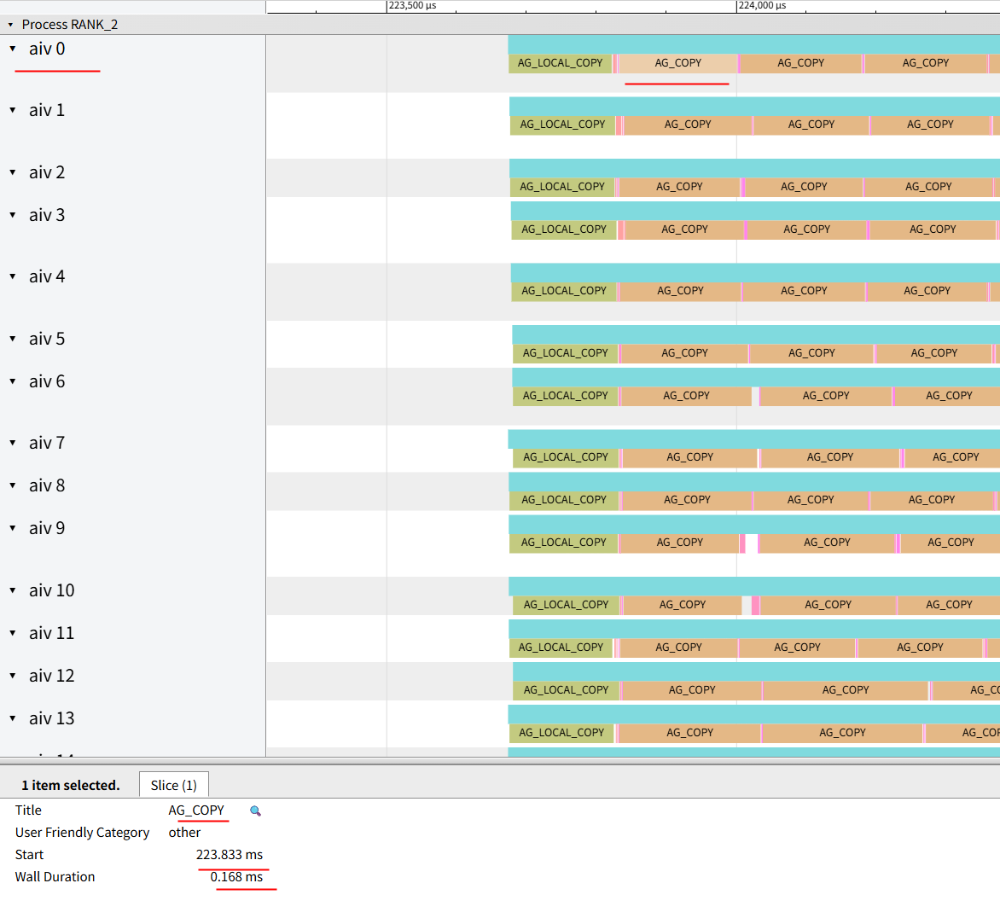

## Profiling tool for operation of device side

On Huawei Ascend NPU, we provide an easy way to profile the inner time cost of each operations.

* [User guide](#1-user-guide)
* [Developer guide](#2-developer-guide)

### 1 User guide

For user, we can get the profiling result by setting a simple environment variable and use browse like 'chrome' to take
a look.

#### 1.1 Detailed usage

##### Step1: enable profiling by setting ENV variable

```shell
export ZBAL_PROF_ENABLE=1
export ZBAL_PROF_MAX_TRACING_COUNT=20480   # optional, max trace count per core, default is 20480
export ZBAL_PROF_DIR=/home/                # optional, profiling output dir, default is /home/
```
##### Step2: run your program

##### Step3: get the trace dump file

When the process exit, the traces dumped to `/home/` automatically.
```shell
cd /home/
ls -l trace_view_*
```

In some cases your process get stock and could not exit normally, you can also use following command to dump a process trace.

```bash
# use the following command or ps -ef to get the process id
npu-smi info

# dump the trace
kill -USR1 <process_id>
```

##### Step4: open it with browse

There are many tools can be used to open and view the details of trace view format json file. Let's take chrome as
example which showing the following picture.


Key in the [chrome://tracing](chrome://tracing) and click the 'load' button to open the json file.

##### Step5: view the details
It is easy to keyboard to view the profile data, i.e. w a s d, w=zoom in, s=zoom out, a=scroll left, d=scroll right
The following picture is show the allGather operation.

We have set some common used tracepoint in enum `zbal_profiling_name_t`, `AG_COPY` and so on, if you want to add your own custom tracepoint to check your operator performance, please follow the **Developer guide** in this wiki.



#### 1.2 Supported operations

| Communication operations           | Supported | Comments |
| ---------------------------------- | --------- | -------- |
| Dispatch Normal with Quant         |           |          |
| Dispatch Normal without Quant      |           |          |
| Combine Normal without Quant       |           |          |
| Dispatch Low Latency with Quant    |           |          |
| Dispatch Low Latency without Quant |           |          |
| Combine Low Latency without Quant  |           |          |
| AllToAll                           |           |          |
| ReduceScatter                      |           |          |
| AllGather                          | Y         |          |
| AllReduce                          |           |          |

### 2 Developer guide

For developer who wants to add more tracepoint or develop a new comm operation.

#### 1 Overall introduction

The tracepoint tool provides a very simple way to use and add your tracepoint, the trace functions cost little cycles and already has no performance influence to the operator, but we still sugguest to close tracepoint after the operator fine tuned.

#### 2 How add tracepoints

##### 2.1 Profiling Trace Detailed Usage
There are steps for add a tracepoint for your operations.

###### Step1: Find the enum `zbal_profiling_name_t` and add your own tracepoint enumuration.

```cpp
enum zbal_profiling_name_t : uint16_t {
    // xxx
    YOUR_TRACE_POINT_ENUM,
    ZBAL_PROF_BUTT,
};
```

###### Step2: Find the global variable `g_profName` to add the tracepoint export name as you want, the names must have the same order with `zbal_profiling_name_t`, and the `true/false` flag is a export flag, which is used to print/ignore export the tracepoint.

```cpp
const std::vector<std::pair<std::string, bool>> g_profName = {
    // xxx
    {"your_trace",         false},
};
```

##### Step3: Add a start/stop trace record function to record timestamp in the operator the code you want to observe. The parameter comm is CommGroupInfo, which would be passed to operator device, the second parameter is your costum tracepoint in  `zbal_profiling_name_t`.
```cpp
ZBAL_PROF_START(comm, YOUR_TRACE_POINT_ENUM);

// the code segment performance you want to observe.

ZBAL_PROF_STOP(comm, YOUR_TRACE_POINT_ENUM);
```

##### 2.2 Debug Trace Detailed Usage
Debug trace is used to export at most 6 numeric variable at a moment to debug the kernel code, it is can be used with profiling trace, and debug trace is more simpler to use.

###### Step1: Add a debug trace at anywhere you like in the kernel code, the `comm` and `__LINE__` is required, the following at most 6 integers is optional, none is allowed, too. When the profiling trace file display in chrome, the `__LINE__` and integers will be shown as attribute with same recording order in bottom windown when you click the trace.

```cpp
ZBAL_PROF_DUMP(comm, __LINE__, integer_1, interger_x, ..., integer_6);
```